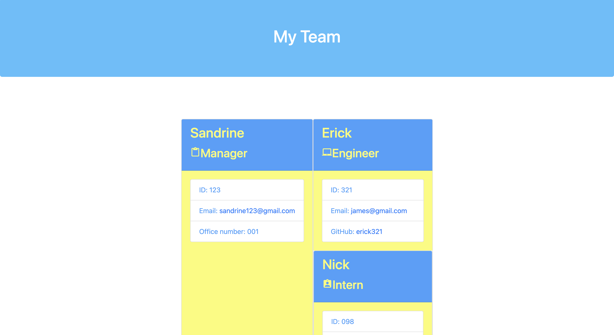

# Team-Profile-Generator

## Description
Application runs in the CLT, and after user input, generates team profiles using javascript.

These generated profiles are then published via HTML and stylized via CSS

## Table of Contents
* [User Story](#userstory)
* [Installation](#installation)
* [Usage](#usage)
* [Tests](#tests)

## User Story

```md
AS A manager
I WANT to generate a webpage that displays my team's basic info
SO THAT I have quick access to their emails and GitHub profiles
```

## Acceptance Criteria

```md
GIVEN a command-line application that accepts user input
WHEN I am prompted for my team members and their information
THEN an HTML file is generated that displays a nicely formatted team roster based on user input
WHEN I click on an email address in the HTML
THEN my default email program opens and populates the TO field of the email with the address
WHEN I click on the GitHub username
THEN that GitHub profile opens in a new tab
WHEN I start the application
THEN I am prompted to enter the team manager’s name, employee ID, email address, and office number
WHEN I enter the team manager’s name, employee ID, email address, and office number
THEN I am presented with a menu with the option to add an engineer or an intern or to finish building my team
WHEN I select the engineer option
THEN I am prompted to enter the engineer’s name, ID, email, and GitHub username, and I am taken back to the menu
WHEN I select the intern option
THEN I am prompted to enter the intern’s name, ID, email, and school, and I am taken back to the menu
WHEN I decide to finish building my team
THEN I exit the application, and the HTML is generated
```

## Installation 
user clones repo from github, and then downloads Node. Inquirer module is required to download using 

```
npm i inquirer
```

## Mock Up

Below is a mock up of the application after being ran


## Usage
Through inquirer, the user will be prompted with questions, after which the applicatoin will create team profiles.
Demo Video -> (https://drive.google.com/file/d/1a1mC-lu0aOrr8osLNE0SlADC2nSpaFDK/view?usp=sharing)

## Tests
Run `npm test` in order to test application.

## Getting Started

This Challenge will combine many of the skills we've covered so far. In addition to the User Story and Acceptance Criteria, we’ve provided some guidelines to help get started.

Because this Challenge will require a video submission, refer to the [Fullstack Blog Video Submission Guide](https://coding-boot-camp.github.io/full-stack/computer-literacy/video-submission-guide) for additional guidance on creating a video.

Your application should use [Jest](https://www.npmjs.com/package/jest) for running the unit tests and [Inquirer](https://www.npmjs.com/package/inquirer/v/8.2.4) for collecting input from the user. The application will be invoked by using the following command:

```bash
node index.js
```

It is recommended that you start with a directory structure that looks like the following example:

```md
.
├── __tests__/             //jest tests
│   ├── Employee.test.js
│   ├── Engineer.test.js
│   ├── Intern.test.js
│   └── Manager.test.js
├── dist/                  // rendered output (HTML) and CSS style sheet      
├── lib/                   // classes
├── src/                   // template helper code 
├── .gitignore             // indicates which folders and files Git should ignore
├── index.js               // runs the application
└── package.json           
```

**Important**: Make sure that you remove `dist` from the `.gitignore` file so that Git will track this folder and include it when you push up to your application's repository.

The application must include `Employee`, `Manager`, `Engineer`, and `Intern` classes. The tests for these classes (in the `_tests_` directory) must ALL pass.

The first class is an `Employee` parent class with the following properties and methods:

* `name`

* `id`

* `email`

* `getName()`

* `getId()`

* `getEmail()`

* `getRole()`&mdash;returns `'Employee'`

The other three classes will extend `Employee`.

In addition to `Employee`'s properties and methods, `Manager` will also have the following:

* `officeNumber`

* `getRole()`&mdash;overridden to return `'Manager'`

In addition to `Employee`'s properties and methods, `Engineer` will also have the following:

* `github`&mdash;GitHub username

* `getGithub()`

* `getRole()`&mdash;overridden to return `'Engineer'`

In addition to `Employee`'s properties and methods, `Intern` will also have the following:

* `school`

* `getSchool()`

* `getRole()`&mdash;overridden to return `'Intern'`

Finally, although it’s not a requirement, consider adding validation to ensure that user input is in the proper format.


